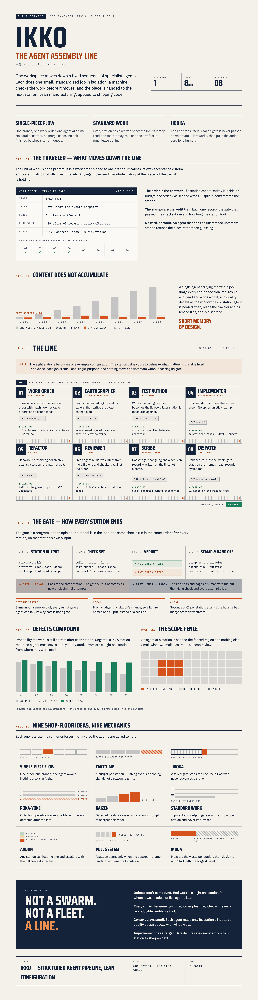

# ikko

The agent assembly line. 一個, one piece at a time.

One work order moves down a fixed sequence of specialist agents. Each does one small, standardised job in isolation, a machine checks the work before it moves, and the piece is handed to the next station. Not a swarm. Not a fleet. A line.

Pre-release. ikko runs on [kansa](https://github.com/ikkolab/kansa), the signed record underneath.
